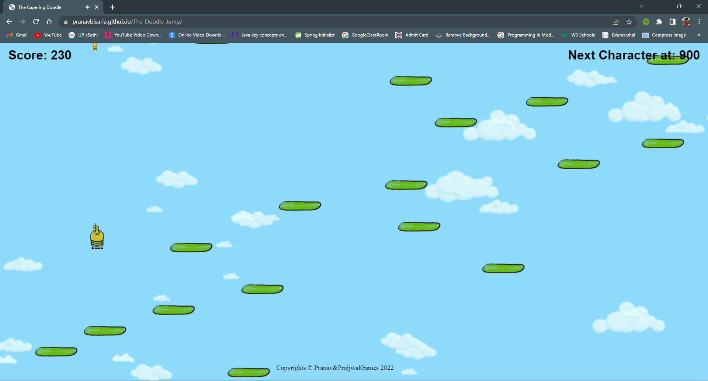

<!-- PROJECT SHIELDS -->
<a id="readme-top"></a>
[![Contributors][contributors-shield]][contributors-url]
[![Forks][forks-shield]][forks-url]
[![Stargazers][stars-shield]][stars-url]
[![Issues][issues-shield]][issues-url]
[![LinkedIn][linkedin-shield]][linkedin-url]

<!-- PROJECT LOGO -->
<br />
<div align="center">
  <a href="https://github.com/pranavbisaria/The-Doodle-Jump">
    
  </a>
<h3 align="center">Doodle Jump</h3>

  <p align="center">
    A JavaScript Based Online Game, that can be played on any browser
    <br />
    <a href="https://github.com/pranavbisaria/The-Doodle-Jump"><strong>Explore the docs »</strong></a>
    <br />
    <br />
    <a href="https://pranavbisaria.github.io/The-Doodle-Jump">View Demo</a>
    ·
    <a href="https://github.com/pranavbisaria/The-Doodle-Jump/issues">Report Bug</a>
    ·
    <a href="https://github.com/pranavbisaria/The-Doodle-Jump/issues">Request Feature</a>
  </p>
</div>


<!-- TABLE OF CONTENTS -->
<details>
  <summary>Table of Contents</summary>
  <ol>
    <li>
      <a href="#about-the-project">About The Project</a>
      <ul>
        <li><a href="#built-with">Built With</a></li>
      </ul>
    </li>
    <li>
      <a href="#getting-started">Getting Started</a>
      <ul>
        <li><a href="#prerequisites">Prerequisites</a></li>
        <li><a href="#installation">Installation</a></li>
      </ul>
    </li>
    <li><a href="#roadmap">Roadmap</a></li>
    <li><a href="#contributing">Contributing</a></li>
    <li><a href="#contact">Contact</a></li>
    <li><a href="#acknowledgments">Acknowledgments</a></li>
  </ol>
</details>


<!-- ABOUT THE PROJECT -->
<a id="about-the-project"></a>
## About The Project
<div style="border: 1px solid #575757;
    padding: 20px;
    overflow: hidden;
    max-width: 900px;
    width: 100%;
    margin: 0 auto;
    position: relative;
    display: flex;
    flex-wrap: wrap;
    justify-content: space-evenly;">

https://user-images.githubusercontent.com/103812595/222959559-aa3c3f33-9cd8-4428-a03e-a2030381592e.mp4
</div>
<div style="border: 1px solid #575757;
    padding: 20px;
    overflow: hidden;
    max-width: 900px;
    width: 100%;
    margin: 0 auto;
    position: relative;
    display: flex;
    flex-wrap: wrap;
    justify-content: space-evenly;">
    
    
    
    
    
    
    
    
</div>
This is a 2D game based on JavaScript, In Doodle Jump, the aim is to guide a four-legged creature called "The Doodler" up a never-ending series of platforms without falling. The left side of the playing field wraps around to the right side.

<p align="right">(<a href="#readme-top">back to top</a>)</p>


<a id="built-with"></a>
### Built With

* ![HTML]
* ![CSS3]
* ![JAVASCRIPT]

<p align="right">(<a href="#readme-top">back to top</a>)</p>


<!-- GETTING STARTED -->
<a id="getting-started"></a>
## Getting Started

This is an example of how you can setup the project and run it locally on your computer system.

### Prerequisites
<a id="prerequisites"></a>

You only need to have a supported browser like a chromium browser or any supported browser.


### Installation
<a id="installation"></a>

1. Clone the repo
   ```sh
   git clone https://github.com/pranavbisaria/The-Doodle-Jump.git
   ```
2. Open the cloned folder using VS Code, IntelliJ Idea or any other IDE.
3. Now serve the project using the live server or directly using index.html.

<p align="right">(<a href="#readme-top">back to top</a>)</p>

<!-- ROADMAP -->
<a id="roadmap"></a>
## Roadmap

- [ ] Basic Player movements.
- [ ] Infinite scrolling background
- [ ] Platform movement along with the player but in opposite direction.
- [ ] Clearing the array for the unused platforms.
- [ ] Collision Logic using the X-Test and Y-Test, X and Y being the co-ordinate axis in 2D.
- [ ] Enemy
- [ ] Changing the background after every fixed score target.
- [ ] Shooting the bullet and its collision logic.
- [ ] Player sprite management

See the [open issues](https://github.com/pranavbisaria/The-Doodle-Jump/issues) for a full list of proposed features (and known issues).

<p align="right">(<a href="#readme-top">back to top</a>)</p>


<!-- CONTRIBUTING -->
<a id="contributing"></a>
## Contributors

Major Contributors:
* [Pranav Bisaria](https://github.com/pranavbisaria)
* [Naman Bansal](https://github.com/Namanbansal06)

Contributions are what make the open source community such an amazing place to learn, inspire, and create. Any contributions you make are **greatly appreciated**.

If you have a suggestion that would make this better, please fork the repo and create a pull request. You can also simply open an issue with the tag "enhancement".
Don't forget to give the project a star! Thanks again!

1. Fork the Project
2. Create your Feature Branch (`git checkout -b feature/AmazingFeature`)
3. Commit your Changes (`git commit -m 'Add some AmazingFeature'`)
4. Push to the Branch (`git push origin feature/AmazingFeature`)
5. Open a Pull Request

<p align="right">(<a href="#readme-top">back to top</a>)</p>

<!-- CONTACT -->
<a id="contact"></a>
## Contact

Pranav Bisaria - [@pranavbisaria29](https://twitter.com/pranavbisaria29) - [pranavbisariya29@gmail.com](mailto:pranavbisariya29@gmail.com)

Project Link: [https://github.com/pranavbisaria/ShopIT-E-Commerce-App](https://github.com/pranavbisaria/ShopIT-E-Commerce-App)

<p align="right">(<a href="#readme-top">back to top</a>)</p>


<!-- ACKNOWLEDGMENTS -->
<a id="acknowledgments"></a>
## Acknowledgments

* [https://www.w3schools.com/html/](https://www.w3schools.com/html/)
* [https://www.w3schools.com/css/](https://www.w3schools.com/css/)
* [https://www.w3schools.com/js/](https://www.w3schools.com/js/)
* [https://www.freecodecamp.org/news/learn-javascript-game-development-full-course/](https://www.freecodecamp.org/news/learn-javascript-game-development-full-course/)

<p align="right">(<a href="#readme-top">back to top</a>)</p>

<!-- MARKDOWN LINKS & IMAGES -->
<!-- https://www.markdownguide.org/basic-syntax/#reference-style-links -->
[contributors-shield]: https://img.shields.io/github/contributors/pranavbisaria/The-Doodle-Jump.svg?style=for-the-badge
[contributors-url]: https://github.com/pranavbisaria/The-Doodle-Jump/graphs/contributors
[forks-shield]: https://img.shields.io/github/forks/pranavbisaria/The-Doodle-Jump.svg?style=for-the-badge
[forks-url]: https://github.com/pranavbisaria/The-Doodle-Jump/network/members
[stars-shield]: https://img.shields.io/github/stars/pranavbisaria/The-Doodle-Jump.svg?style=for-the-badge
[stars-url]: https://github.com/pranavbisaria/The-Doodle-Jump/stargazers
[issues-shield]: https://img.shields.io/github/issues/pranavbisaria/The-Doodle-Jump.svg?style=for-the-badge
[issues-url]: https://github.com/pranavbisaria/The-Doodle-Jump/issues
[license-shield]: https://img.shields.io/github/license/pranavbisaria/The-Doodle-Jump.svg?style=for-the-badge
[license-url]: https://github.com/pranavbisaria/The-Doodle-Jump/blob/master/LICENSE.txt
[linkedin-shield]: https://img.shields.io/badge/-LinkedIn-black.svg?style=for-the-badge&logo=linkedin&colorB=555
[linkedin-url]: https://www.linkedin.com/in/pranavbisaria
[JAVASCRIPT]: https://img.shields.io/badge/javascript-%23323330.svg?style=for-the-badge&logo=javascript&logoColor=%23F7DF1E
[HTML]: https://img.shields.io/badge/html5-%23E34F26.svg?style=for-the-badge&logo=html5&logoColor=white
[CSS3]: https://img.shields.io/badge/css3-%231572B6.svg?style=for-the-badge&logo=css3&logoColor=white
